# SignalAI — Documentación Técnica y Funcional

---

## Índice

1. [Nivel Producto](#1-nivel-producto)
   - 1.1 Visión General
   - 1.2 Flujo del Usuario
   - 1.3 Features Principales
2. [Nivel Financiero](#2-nivel-financiero)
   - 2.1 Motor de Scoring (0-1000)
   - 2.2 Diversificación (HHI)
   - 2.3 Risk Match (Beta + Volatilidad)
   - 2.4 Retorno Ajustado por Riesgo (Sharpe Ratio)
   - 2.5 Downside Protection
   - 2.6 Modelo de Allocation Óptima
   - 2.7 Motor de Recomendaciones AI
   - 2.8 Simulación de Score Impact
3. [Nivel Técnico](#3-nivel-técnico)
   - 3.1 Arquitectura General
   - 3.2 Stack Tecnológico
   - 3.3 Base de Datos (Supabase + PostgreSQL)
   - 3.4 API Routes
   - 3.5 Providers de Datos de Mercado
   - 3.6 Integración AI (Claude + Vercel AI SDK)
   - 3.7 Seguridad y Autenticación
   - 3.8 Deploy y CI/CD

---

## 1. Nivel Producto

### 1.1 Visión General

SignalAI es una plataforma de análisis cuantitativo de portfolios de inversión con inteligencia artificial. El usuario carga sus posiciones (acciones USA, ETFs sectoriales, ETFs de bonos, bonos soberanos argentinos, efectivo) y recibe un **score de 0 a 1000** con diagnóstico multidimensional y recomendaciones accionables para optimizar su portfolio.

### 1.2 Flujo del Usuario

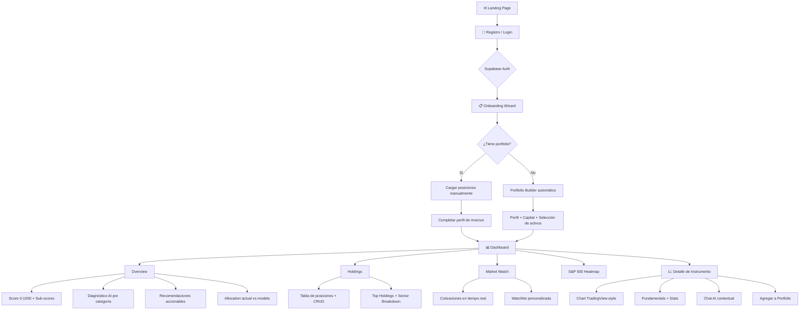

### 1.3 Features Principales

| Feature | Descripción |
|---------|-------------|
| **Portfolio Score** | Score compuesto 0-1000 con 4 sub-scores de 0-250 cada uno |
| **Diagnóstico AI** | Análisis por categoría con severidad (Saludable/Atención/Crítico) |
| **Recomendaciones** | Movimientos de allocation + picks de instrumentos con impacto medible |
| **Portfolio Builder** | Onboarding guiado: arma portfolio según perfil, capital y preferencias |
| **Market Watch** | Cotizaciones en tiempo real, watchlist personalizada |
| **S&P 500 Heatmap** | Treemap interactivo filtrable por sector con colores según variación |
| **Chat AI** | Chat contextual por instrumento con acceso a datos en vivo |
| **Asesor AI** | Chat general con contexto completo del portfolio y score |
| **Soporte Multi-Asset** | Acciones USA, ETFs, bonos argentinos (ARS/USD), efectivo |
| **Educación Financiera** | Tooltips con justificación teórica en cada decisión |

---

## 2. Nivel Financiero

### 2.1 Motor de Scoring (0-1000)

El score total es la **suma de 4 sub-scores independientes**, cada uno con un máximo de 250 puntos:

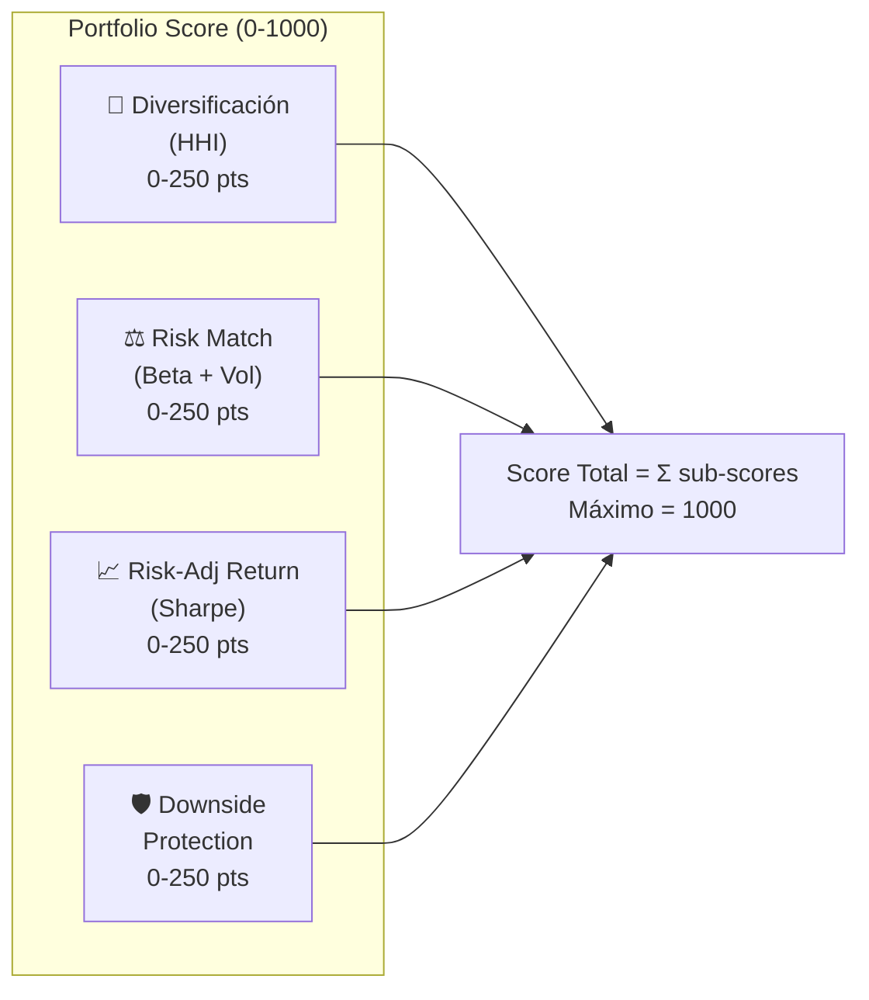

Fórmula general:

```
Score_Total = Score_Diversificación + Score_RiskMatch + Score_RiskAdjReturn + Score_DownsideProtection
```

Cada sub-score se calcula con `clampScore()` que limita el valor entre 0 y 250 (redondeado).

### 2.2 Diversificación (HHI — Índice de Herfindahl-Hirschman)

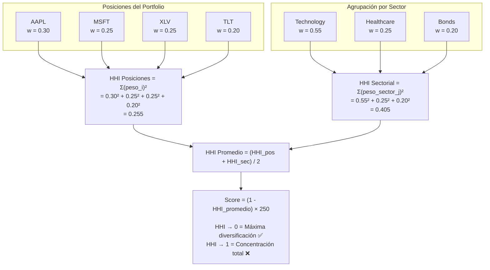

**Interpretación:**
- HHI cercano a 0 = máxima diversificación = score alto
- HHI cercano a 1 = concentración total = score bajo
- Se promedian HHI por posición y HHI por sector para capturar ambas dimensiones de concentración

### 2.3 Risk Match (Beta + Volatilidad vs. Perfil)

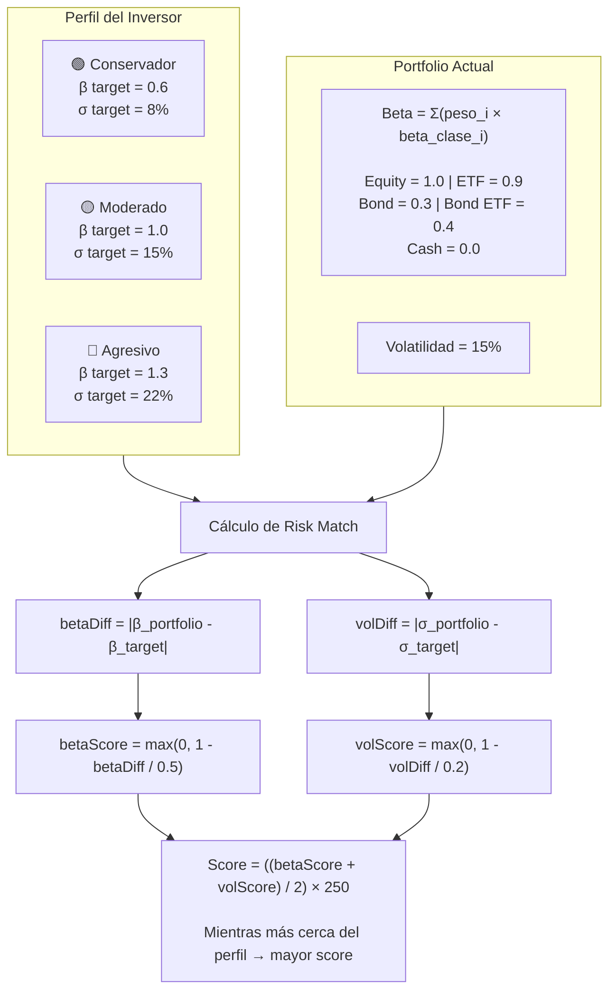

**Interpretación:**
- Mide qué tan bien se alinea el riesgo del portfolio con las expectativas del perfil del inversor
- Un inversor conservador con portfolio de beta alto recibe score bajo
- Un inversor agresivo con portfolio conservador también recibe score bajo

### 2.4 Retorno Ajustado por Riesgo (Sharpe Ratio)

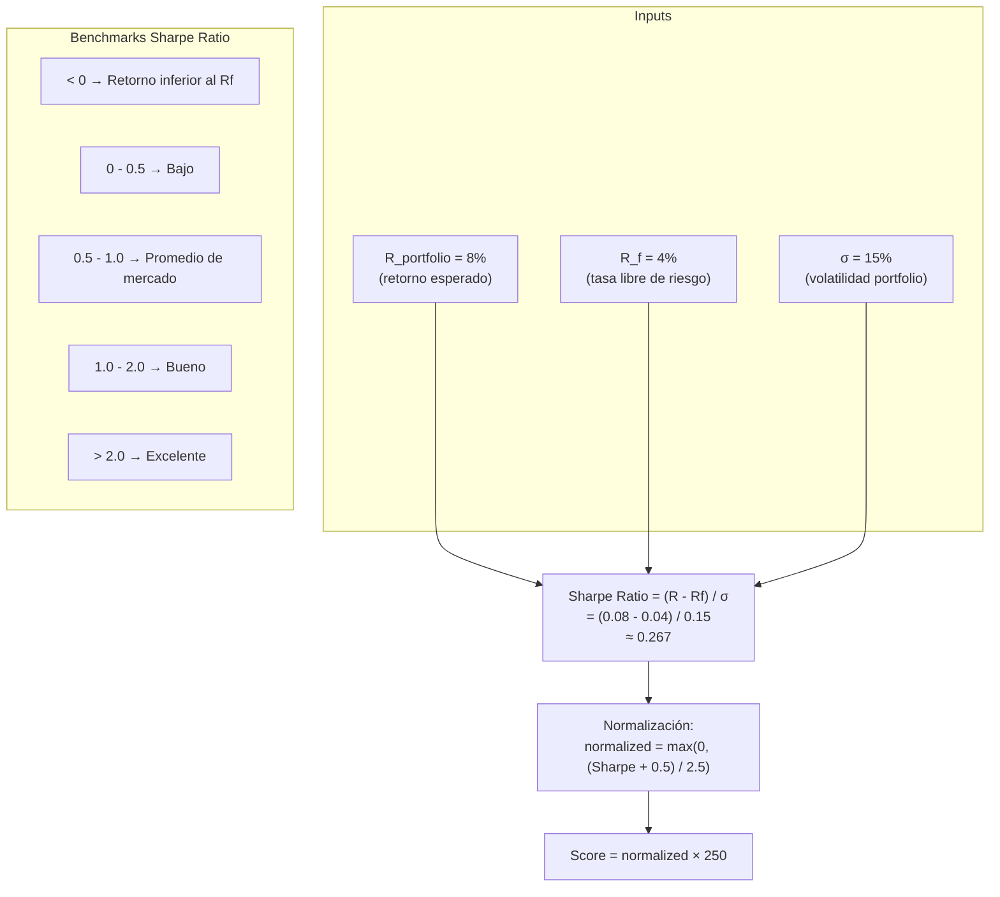

### 2.5 Downside Protection

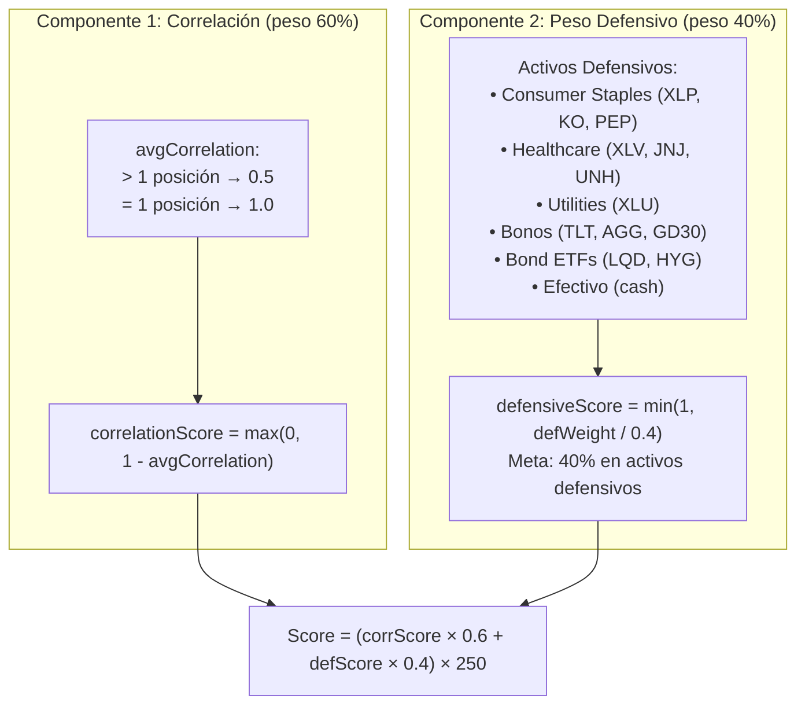

### 2.6 Modelo de Allocation Óptima

El modelo de allocation calcula la distribución ideal de assets según el perfil del inversor. Es un **motor de reglas** que ajusta una base según las preferencias del usuario.

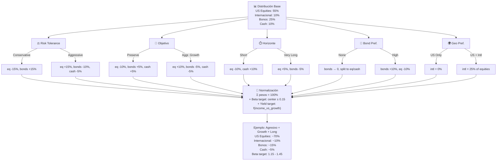

### 2.7 Motor de Recomendaciones AI

Las recomendaciones se generan en dos capas:

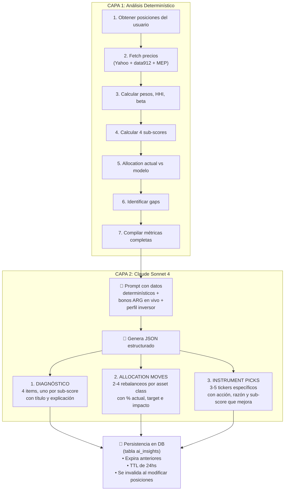

### 2.8 Simulación de Score Impact

El sistema cuenta con un **ranker de candidatos por impacto en score**:

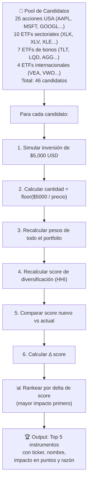

---

## 3. Nivel Técnico

### 3.1 Arquitectura General

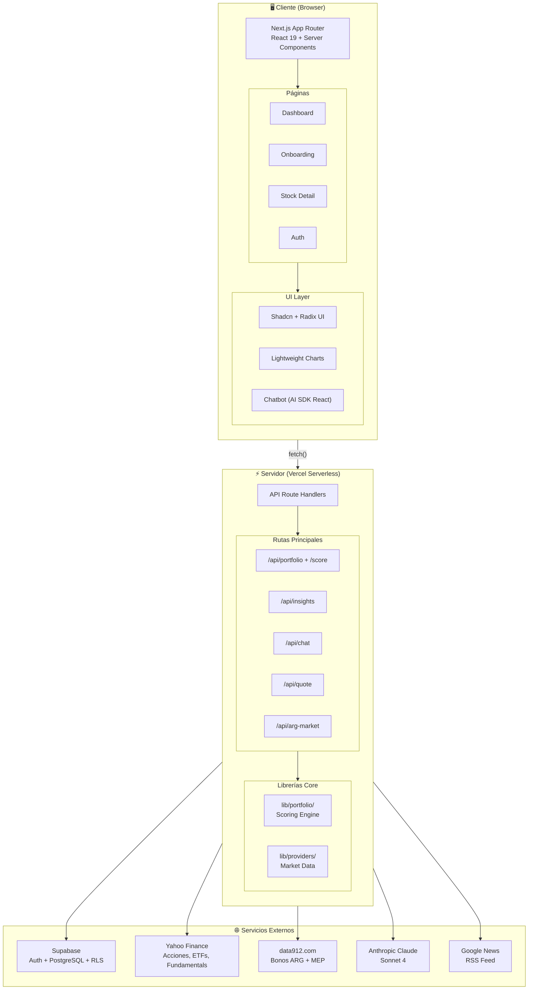

### 3.2 Stack Tecnológico

| Capa | Tecnología | Versión | Uso |
|------|-----------|---------|-----|
| **Framework** | Next.js | 16.2.4 | App Router, SSR, API Routes |
| **UI** | React | 19.2.4 | Server + Client Components |
| **Estilos** | Tailwind CSS | 4 | Utility-first CSS |
| **Componentes** | Radix UI + Shadcn | — | Primitivos accesibles |
| **Íconos** | Lucide | — | Icon library |
| **Animaciones** | Motion | — | Animaciones fluidas |
| **Temas** | next-themes | — | Dark mode (default) |
| **Charts** | Lightweight Charts | — | TradingView-style charts |
| **Auth** | Supabase Auth | — | Email/password, JWT, RLS |
| **DB** | Supabase (PostgreSQL) | — | Base de datos relacional |
| **AI** | Anthropic Claude | Sonnet 4 | Diagnóstico + Chat |
| **AI SDK** | Vercel AI SDK | — | Streaming + tool calling |
| **Market Data** | yahoo-finance2 | — | Cotizaciones, fundamentals |
| **Bonos ARG** | data912.com | — | Bonos soberanos + MEP |
| **Noticias** | Google News | — | RSS feed parsing |
| **Validación** | Zod | — | Schema validation |
| **Analytics** | Vercel Analytics | — | Web analytics |
| **Deploy** | Vercel | — | Serverless, Edge |
| **Package Mgr** | pnpm | — | Dependency management |

### 3.3 Base de Datos (Supabase + PostgreSQL)

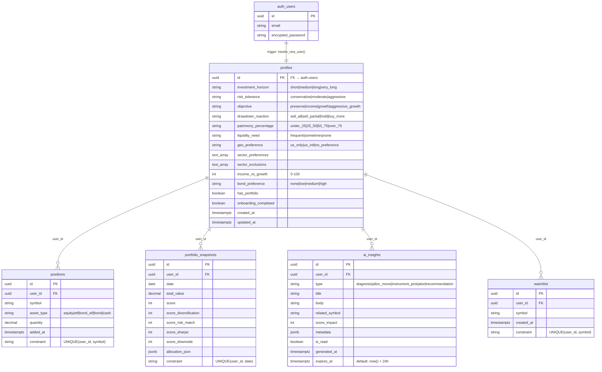

**Seguridad:** Row Level Security (RLS) habilitado en **todas** las tablas. Cada usuario solo puede ver y modificar sus propios datos (`auth.uid() = user_id`).

### 3.4 API Routes

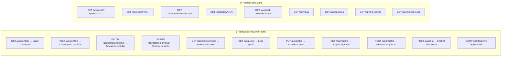

### 3.5 Providers de Datos de Mercado

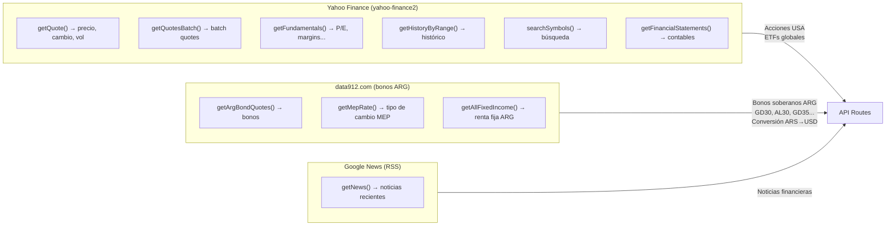

### 3.6 Integración AI (Claude + Vercel AI SDK)

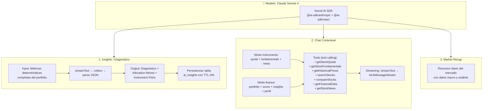

### 3.7 Seguridad y Autenticación

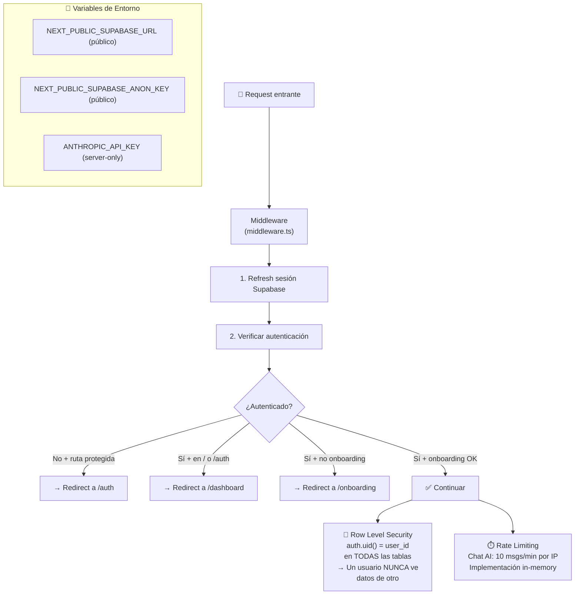

### 3.8 Deploy y CI/CD

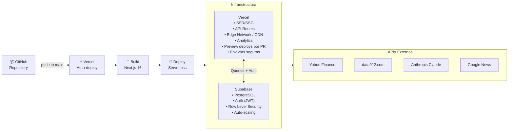

---

## Resumen: Flujo End-to-End

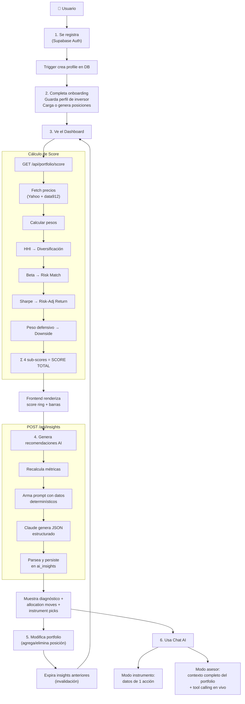
